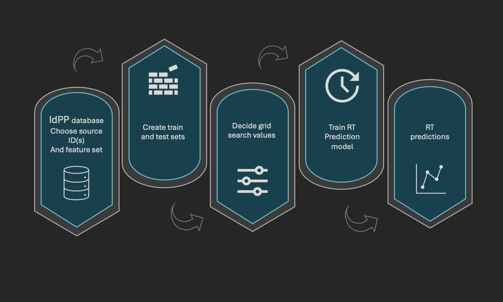
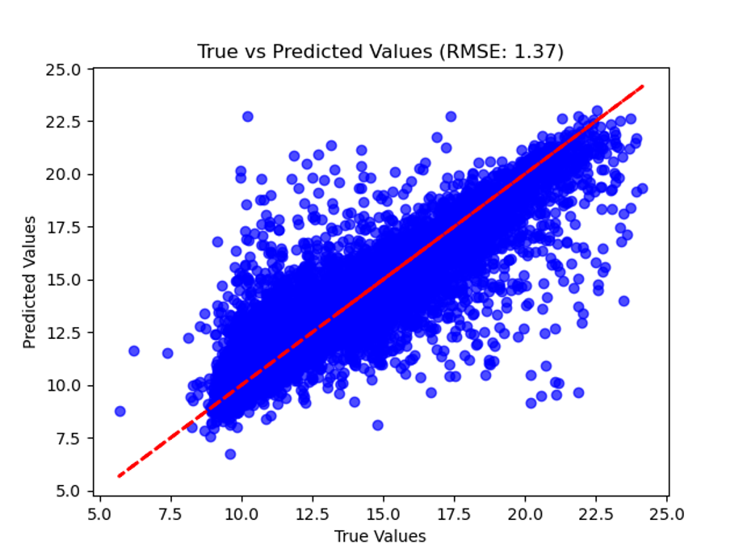

# rtp Installation and set up

clone the rtp repo using the git clone command in the terminal

The environment for using the rtp package consists of the following:

- Python3.10
    - Python3.12 does not have a working `tensorflow` yet so we are stuck with 3.10 
- main requirements (all `pip` installable):
    - `rdkit`
    - `tensorflow==2.15.0`
    - `keras==3.0.4`
        - `keras` gets installed automatically when installing `tensorflow` but it is an older version so it needs to be force-upgraded afterwards to get the current version
    - `scikit-learn`
    - `numpy`
    - `matplotlib`
- The version of SQLite3 built into Python3.10 does not support the `STRICT` mode for database table definitions and actually raises errors if you try to read a database with `STRICT` tables. To be able to read data from the existing `idpp.db` (which has `STRICT` tables), I just made a copy of it without `STRICT` (`idpp_nostrict.db`). This works for now but is kind of an annoying non-solution, need to figure out something better at some point.

# Using rtp

If you would like to use rtp to train and test using one or more of the models in this packages, proceed with the steps outlined below. If you would like to utilize the top performing pre-trained rtp model, continue to the "Model Testing and Evaluation" step.

# Selecting Data

There are two ways to input molecules into the rtp model. The first is by downloading a copy of the IdPP database, the second is by creating a list of valid SMILES strings. If you are using the IdPP database, you need to find the src_ids of the dataset(s) that you would like to use to train and test the model with. Below is an example of what the IdPP database will look like:

](image-1.png)


# Creating train and test sets

### Using IdPP database – 

You will use the assemble_dataset_arrays() function to output three arrays: labels, features and retention times. These arrays will be used to create the train and test sets.  To use this function, choose src_id(s) from the IdPP database from the RTs section. Input the filepath to the idpp.db database. Choose which feature set to calculate. The two options are MQN which does not require the fingerprint size parameter. The other option is FP which requires a fingerprint size parameter. For the top performing method for predicting retention time values FeatureSet.FP was used along with a fingerprint size of 1024. Below is an example of what this input looks like:

```
labels, features, rts = assemble_dataset_arrays([5,231],
                                                "./idpp.db",
                                                FeatureSet.FP,
                                                fp_size)

```

Now that the arrays have been created split_train_test_data() is used to split the retention times (rts) array into train and test sets and returns the indicies of these sets. Then to create train and test labels, features and rts sets the indicies are used as shown here:

```
# split into training/test sets

train_idx, test_idx = split_train_test_data(rts)

train_labels, train_features, train_rts = labels[train_idx], features[train_idx], rts[train_idx]

test_labels, test_features, test_rts = labels[test_idx], features[test_idx], rts[test_idx]
   
```
 

### Using list of SMILES:

To use a list of SMILES strings as input you must instead use the get_features() function. This function takes in a list of SMILES strings, your choice of feature type to be calculated, again, the two options are MQN which does not require the fingerprint size parameter or FP which requires a fingerprint size parameter. The function will in turn return a dataset of type numpy.ndarray(dtype=numpy.uint8) and a list of any smiles strings where features were not able to be produced.

Now that the dataset has been created split_train_test_data() is used to split the retention times (rts) array into train and test sets and returns the indicies of these sets. Then to create train and test labels, features and rts sets the indicies are used as shown previously in the "Using IdPP Database" section. 


# Grid Search Parameters

 To choose the best set of parameters for the model of your choosing a grid search is done. A list of options for each parameter is necessary. Below is an example of the parameter options for the SVR model:

 ```
c = [.001, .01, .1, 1, 10, 100, 1000]
gamma= ['scale', 'auto', .0001, .001, .01, .1, 1, 10, 100]
```    

You will find more parameter options in the example file for the sklearn model, test_sklearn_model.py, and in the example file for the keras model, test_keras_model.py.

# Model Training

To train the model use one of the training functions from the sklearn_models.py or keras_model.py files. For this example the train_SVR() function is used. The train functions take in the training features set, the training rts set a filepath and lists of values for each parameter that is used in the grid search. The **filepath** is where the trained instance of the model will be saved as a **.pkl** file. 

```
filepath = "./trained_model.pkl"

svm = train_SVR(train_features, 
                train_rts,
                filepath,
                c,
                gamma)
```

# Model Testing and Evaluation

To test the model use the model_predictions() function. This function takes in the trained instance of the model with the best parameters determined by the grid search and the test features array.

The metrics() function is then used to evaluate the model with evaluation metrics mean absolute error (MAE) and root mean squared error (RMSE). This function takes in the predictions made and the test retention times array. 

```
svm_pred = model_predictions(svm, test_features) 

eval_svm = metrics(svm_pred, test_rts)
```
 


# Plot the Results

To plot the model use the plots() function. This function takes in the test rt array and the rt predictions. The plot will show the True rt values versus the predicted rt values. Below is an example of what the plot will look like. The example used is the model that performed the best, it’s the SVR model that used fingerprints of size 1024 with parameter ‘C’ equal to 10.

]

 


